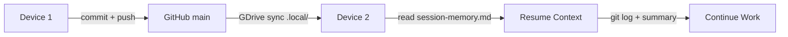

# Git Safety — Cross-Device & Cross-Platform Locking

> **Purpose:** Prevent cross-device conflicts, enforce commit discipline,
> and carry session history seamlessly across different machines.

## 🔒 Rule 1: Validate Remote Origin Before Any Execution

**MANDATORY CHECK before any model executes code:**

```bash
# Check that origin points to the expected remote
git remote -v

# Verify we're on main branch (no branching allowed)
git branch --show-current
```

If `git remote origin` is misconfigured or points to an unexpected URL:
1. **STOP.** Do not execute.
2. **FLAG** the mismatch to the user.
3. **DO NOT** modify git config without explicit user confirmation.

## 🔒 Rule 2: Solo Main — No Branch, No PR

```
🚫 NO branch creation
🚫 NO pull request
🚫 NO worktree isolation
✅ COMMIT DIRECTLY TO main ONLY
```

## 🔒 Rule 3: Automated Short Summary for Session Carry-Over

After any significant session, generate a short summary marker:

```bash
# Write session summary to .local/session-memory.md with format:
#
# ## [YYYY-MM-DD HH:MM] — <session title>
# **Status:** <completed|in-progress|blocked>
# **Context:** <2-3 sentence summary of what was done>
# **Next:** <the very next action needed>
# **Cross-reference:** <commit hash / key decisions>
```

This ensures that when you resume on a different device:

1. Read `.local/session-memory.md` (from GDrive sync).
2. `git log --oneline -5` to see latest commits.
3. Cross-reference the session summary with the git history.
4. Resume without losing context.

## 🔒 Rule 4: Pre-Commit Validation

Before every `git commit`, validate:

- [ ] No debug print statements left in code
- [ ] No hardcoded secrets/API keys
- [ ] `git diff --cached` reviewed for accidental includes
- [ ] Commit message follows: `type(scope): brief description`
  - Types: `feat`, `fix`, `docs`, `refactor`, `test`, `chore`, `perf`

## 🔒 Rule 5: Cross-Device Continuity Protocol



1. Always `git push` before switching devices.
2. GDrive syncs `.local/` (profile, session-memory, secrets) independently.
3. On new device: `git pull` → read `.local/session-memory.md` → continue.
